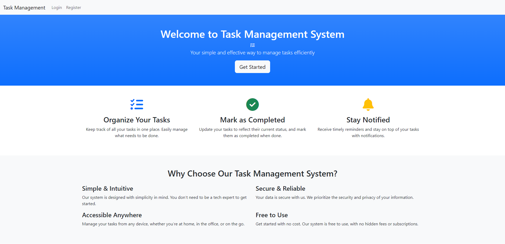
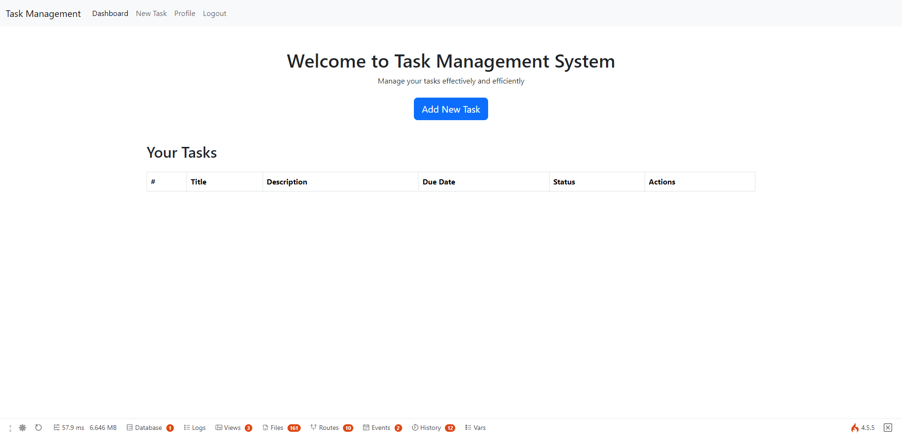
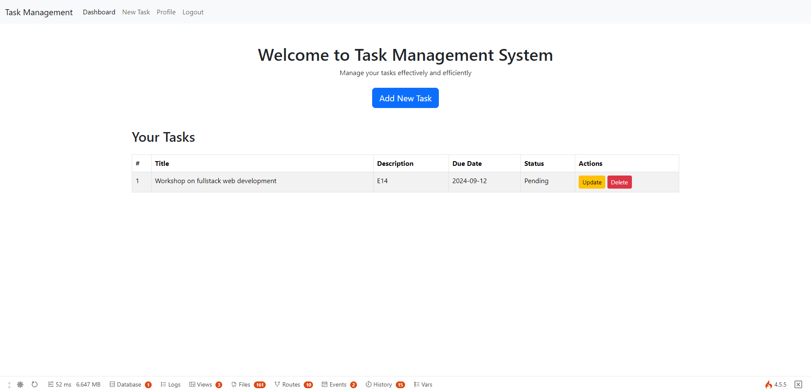
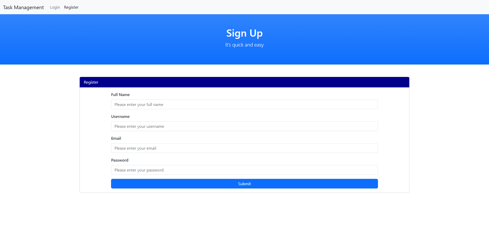
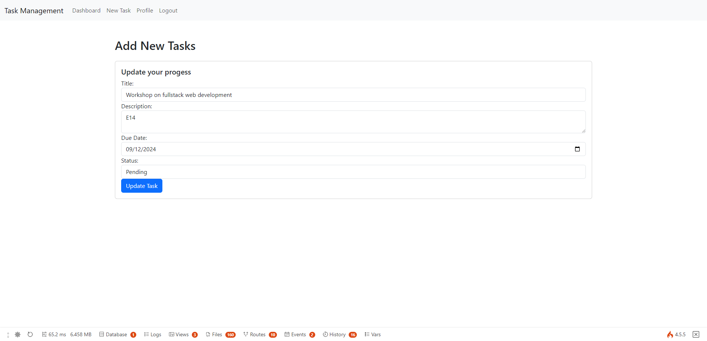
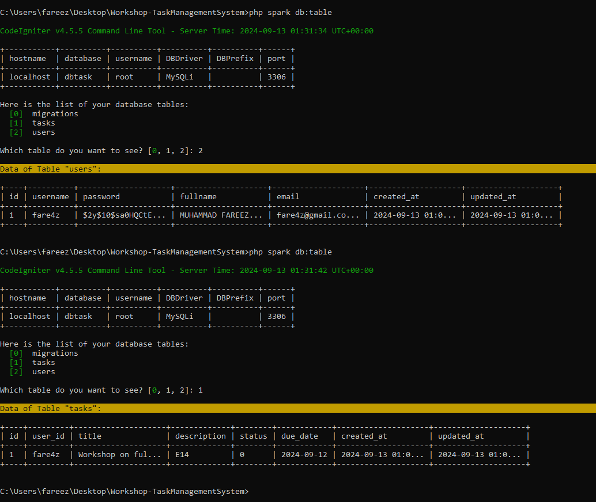
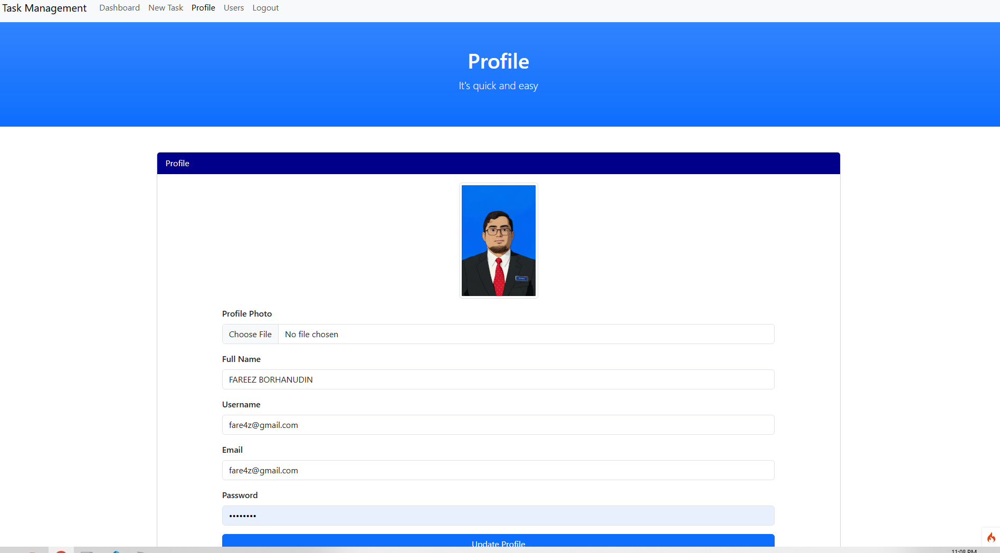
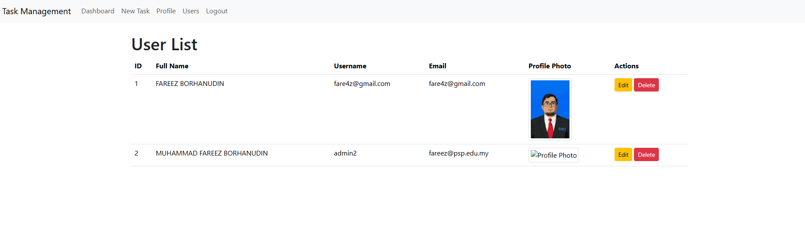

# Workshop on Full Stack Web Development
**Date**: 10 - 12 September 2024  
**Venue**: E14, Politeknik Seberang Perai  

## Agenda
1. Introduction to Full Stack Web Development
2. Version Control System (VCS)
3. Front End Development (Using Bootstrap 5)
4. Back End Development (Using CodeIgniter4 Framework)

---

## Final Output: Task Management System

### Screenshots

<table>
  <tr>
    <td></td>
    <td></td>
  </tr>
  <tr>
    <td></td>
    <td></td>
  </tr>
  <tr>
    <td></td>
    <td></td>
  </tr>

  <tr>
    <td></td>
    <td></td>
  </tr>

</table>

---

### Steps to Run the Project

### Important Notes for Running the Project

> **Note**: The following commands need to be executed in Command Prompt (CMD) or Terminal.


1. **Clone the repository**:
   ```bash
   git clone https://github.com/fare4z/Workshop-TaskManagementSystem.git
   ```
   
2. **Navigate into the project directory**:
   ```bash
   cd Workshop-TaskManagementSystem
   ```

3. **Install dependencies via Composer**:
   ```bash
   composer install
   ```

4. **Set up the environment file**:
   - Duplicate `env` and rename it to `.env`.
   '''bash
   cp env .env
   '''

   - Modify the necessary configurations like database settings.

5. **Create Database**:
   - Create a new database named `dbTaskDemo` in your MySQL server.

   ```bash
   php spark db:create dbTaskDemo
   ```

5. **Run migration files**:
   ```bash
   php spark migrate
   ```

6. **Run seed files**:
   ```bash
   php spark db:seed UserSeeder
   ```

7. **Run the local development server**:
   ```bash
   php spark serve
   ```

8. Access the application via `http://localhost:8080`.

---


## Notes & Materials

For further reading and additional materials, visit <a href="https://url.fare4z.com/CxsnC" target="_blank">here</a>.


## Email Setup
To enable email functionality in the application, follow these steps:
1. Sign up for a MailTrap account at <a href="https://mailtrap.io/" target="_blank">MailTrap</a>.
