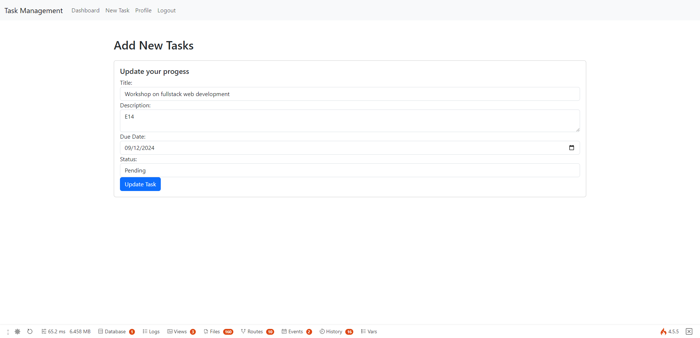

# Workshop on Full Stack Web Development
**Date**: 10 - 12 September 2024  
**Venue**: E14, Politeknik Seberang Perai  

## Agenda
1. Introduction to Full Stack Web Development
2. Version Control System (VCS)
3. Front End Development (Using Bootstrap 5)
4. Back End Development (Using CodeIgniter4 Framework)

---

## Lab Activity 4 Final Result: Task Management System

### Screenshots

<table>
  <tr>
    <td></td>
    <td></td>
  </tr>
  <tr>
    <td></td>
    <td></td>
  </tr>
  <tr>
    <td></td>
    <td></td>
  </tr>
</table>

---

### Steps to Run the Project

1. **Clone the repository**:
   ```bash
   git clone https://github.com/fare4z/Workshop-TaskManagementSystem.git
   ```
   
2. **Navigate into the project directory**:
   ```bash
   cd Workshop-TaskManagementSystem
   ```

3. **Install dependencies via Composer**:
   ```bash
   composer install
   ```

4. **Set up the environment file**:
   - Duplicate `.env.example` and rename it to `.env`.
   - Modify the necessary configurations like database settings.

5. **Run migration files**:
   ```bash
   php spark migrate
   ```

6. **Run the local development server**:
   ```bash
   php spark serve
   ```

7. Access the application via `http://localhost:8080`.

---

## Notes & Materials
For further reading and additional materials, visit [here](https://fare4z.com/url/Ry8d7).
